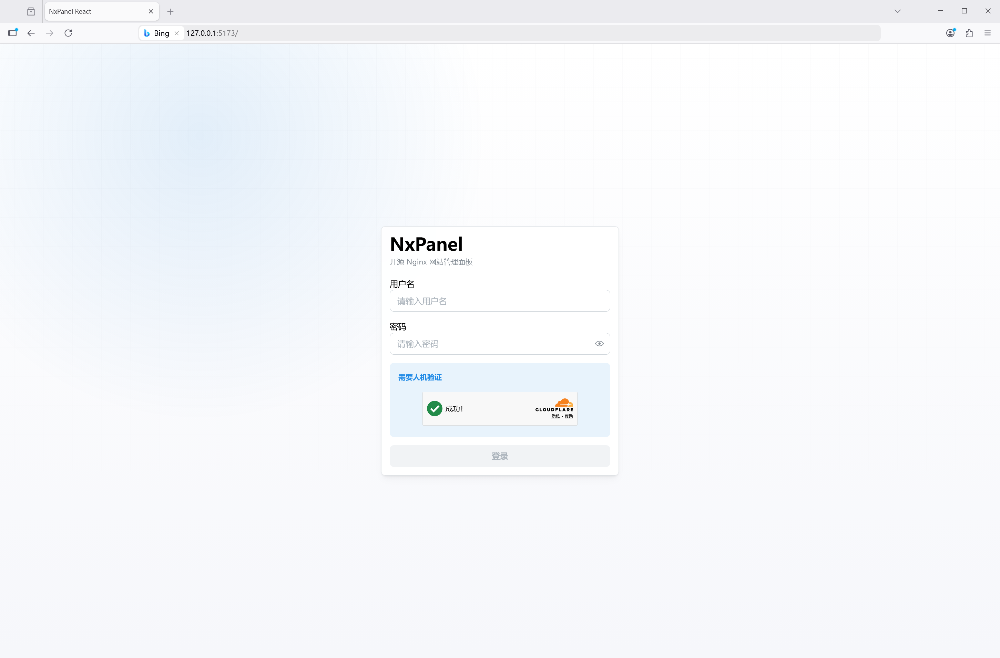
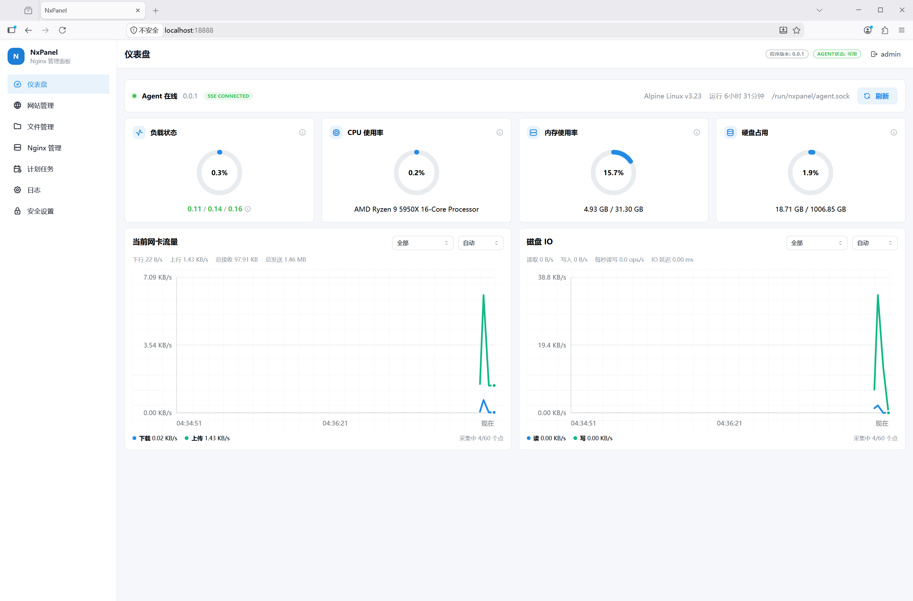
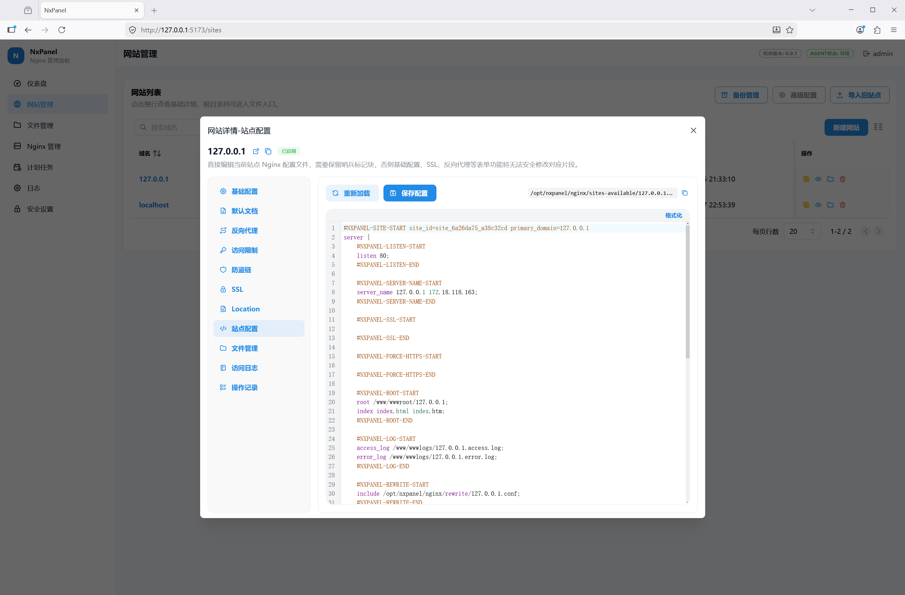
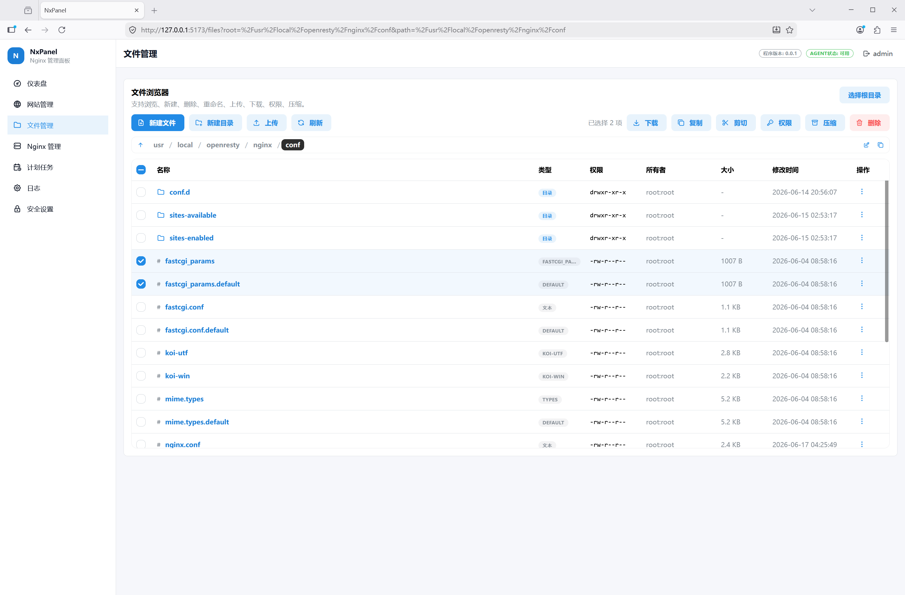

<p align="center">
  <strong>NxPanel — 轻量 Nginx/OpenResty 网站管理面板</strong>
</p>

<p align="center">
  
  
  
  
  
  
</p>

<p align="center">
  <a href="#快速开始">快速开始</a>
  · <a href="#项目定位">项目定位</a>
  · <a href="#功能概览">功能概览</a>
  · <a href="#配置">配置</a>
  · <a href="#开发命令">开发命令</a>
  · <a href="#排障提示">排障提示</a>
</p>

> 项目的初衷是方便自己接管生产环境中已有的 Nginx：不想继续手写和维护大量 Nginx 配置，故本项目专注于 Nginx/OpenResty 的站点、证书、日志、文件和常用运维操作，不提供数据库、运行环境、应用商店等传统服务器面板功能。

> NxPanel 的界面布局、Nginx 控制思路体验参考了宝塔的成熟设计(因为我个人体验了很多款面板，还是觉得宝塔的布局操作顺手)。感谢宝塔提供了优秀的产品思路和实践样板；也正因为现在有了 AI 辅助，个人开发者也能更快地把一个面向自己需求的 Nginx 管理面板实现出来。

> [!WARNING]
> 本项目包含 AI 辅助生成或修订的代码。维护者会对代码进行人工审查，但**不保证**代码不存在缺陷、漏洞、兼容性问题或合规风险。
>
> 本项目按“现状”提供，不附带任何安全承诺、生产适用性承诺或完整安全审计保证。若你计划将其用于生产环境，请自行完成代码审阅、部署测试、安全加固和变更回滚预案。


## 导航

<table>
  <tr>
    <td><strong>了解项目</strong></td>
    <td>
      <a href="#项目定位">项目定位</a> ·
      <a href="#使用流程">使用流程</a> ·
      <a href="#功能概览">功能概览</a> ·
      <a href="#技术栈">技术栈</a>
    </td>
  </tr>
  <tr>
    <td><strong>安装使用</strong></td>
    <td>
      <a href="#快速开始">快速开始</a> ·
      <a href="#docker-部署">Docker 部署</a> ·
      <a href="#二进制模式安装-nxpanel">二进制安装</a> ·
      <a href="#配置">配置</a>
    </td>
  </tr>
  <tr>
    <td><strong>开发发布</strong></td>
    <td>
      <a href="#从源码构建">源码构建</a> ·
      <a href="#开发命令">开发命令</a> ·
      <a href="#release-流程">Release 流程</a>
    </td>
  </tr>
  <tr>
    <td><strong>维护排障</strong></td>
    <td>
      <a href="#排障提示">排障提示</a> ·
      <a href="#license">License</a>
    </td>
  </tr>
</table>


## 项目定位

NxPanel 面向单机部署(后续可能支持主从控制)，采用 **API + Agent 双进程架构**：API 进程以非 root 用户运行，负责 Web API、前端、认证和 SQLite 数据；Agent 进程以 root 运行，负责 Nginx 配置、证书、日志、文件系统和系统命令。

本项目核心目标是不用反复手写 Nginx 配置，能通过 Web UI 管理站点、反向代理、SSL、日志、文件和常用 Nginx 参数。

其次，**不会上传任何服务器信息**。

目前项目支持两种使用方式：

| 模式 | 控制权 | 适合用户 |
|---|---|---|
| 完全接管 | NxPanel 完全控制容器内或新安装的 Nginx/OpenResty | 新服务器、普通用户、希望开箱即用的用户 |
| 接入已有 Nginx | NxPanel 只接管被导入或新建的部分站点配置 | 有经验用户、已有生产环境、希望保留原 Nginx 结构的用户 |


### 完全接管

推荐优先使用 **Docker** ：容器内同时运行 Nginx、Agent 和 API。

适合新服务器，或者你希望 NxPanel 从一开始就统一管理 Nginx。

这种模式下，站点配置、证书、日志、网站目录和 Nginx reload 都由面板管理。Docker 部署就是完全接管：容器里同时运行 Nginx/OpenResty、Agent 和 API，宿主机不需要再安装 Nginx。

#### 操作流程

1. 按下面的 Docker 部署方式启动 NxPanel。(二进制安装均可)
2. 打开面板，创建管理员账号。
3. 到 `Nginx 管理 - 安装Include` 点击按钮安装一个 include 入口。
4. 创建站点，然后按需配置 SSL、反向代理、伪静态、访问限制、文件和日志。

### 接入已有 Nginx

适合服务器上已经有 Nginx/OpenResty 和线上站点的情况。

这种方式安装好 NxPanel 后，需要到 `Nginx 管理 - 安装Include` 点击按钮在 `nginx.conf` 文件安装一个 include 入口。

> 导入的站点只能使用站点详情里 站点配置、文件管理、访问日志、操作记录。

需要注意：已有环境的 root、日志目录和自定义 include 结构可能不统一，使用前需要确认路径白名单和导入提示。

路径白名单: 在 `configs/config.yaml` 的 `agent.allowed_roots` `nginx.allowed_root_prefixes` `nginx.allowed_log_prefixes`，在此处配置后，agent服务只可操作白名单列表的目录、程序安装目录、程序数据管理目录。

#### 操作流程

1. 安装 host 模式，保持原来的 Nginx/OpenResty 继续运行。
2. 在 `Nginx 管理` 中检测现有 Nginx，并安装 include 入口。
3. 导入已有站点，确认导入提示和路径白名单。
4. 之后只通过面板管理已导入或新建的站点；未导入的站点仍按原方式维护。


### 界面预览

<table>
	<tr>
		<td align="center" >
			
			<br /> 登录页
		</td>
		<td align="center">
			
			<br /> 仪表盘
		</td>
  </tr>
	<tr>
    <td align="center">
			
			<br /> 网站配置
		</td>
    <td align="center">
			
			<br /> 文件管理
		</td>
	</tr>
</table>

## 功能概览

| 功能 | 说明 |
|---|---|
| 站点管理 | 创建、导入、更新、启用、禁用、删除站点，支持静态站点和 SPA 模式 |
| 文档增强 | 管理默认首页顺序、autoindex、403/404 页面 URI |
| 多反向代理 | 每个站点支持多条代理规则、路径冲突检测、WebSocket、超时配置 |
| 代理缓存 | 管理 Nginx `proxy_cache` 和 `proxy_store` 相关配置 |
| SSL 管理 | 上传 PEM、使用已有证书文件、查看证书内容、下载证书、禁用 SSL |
| ACME 证书 | Let's Encrypt 申请、续签、部署、下载、自动续签和任务日志 |
| 证书仓库 | 集中管理证书并部署到站点 |
| 伪静态 | 内置模板、参数渲染、预览、站点 rewrite include 管理 |
| 访问限制 | Basic Auth 加密访问、禁止访问规则、防盗链规则 |
| 完整配置编辑 | 编辑站点完整 Nginx 配置，支持 marker 迁移 |
| 访问分析 | 站点日志扫描、格式检测、趋势、路径/IP 聚合、异常洞察、CSV 导出 |
| Nginx 管理 | 检测、安装 include 入口、`nginx -t`、reload、主配置编辑、常用参数管理 |
| 文件管理 | 全局文件管理和站点级文件管理，支持读写、上传、下载、复制、移动、压缩、解压、权限和属主修改 |
| 日志管理 | 站点 access/error 日志 tail、搜索、下载、实时追踪、历史切割日志查看和删除 |
| 服务日志 | API/Agent 运行日志 tail、实时流、清空，支持内置切割 |
| 任务日志 | ACME 等计划任务日志读取和清空 |
| 系统概览 | 系统信息、Nginx 状态、升级检测和运行状态 |
| 系统指标 | SSE 推送 CPU、内存、磁盘、网络、磁盘 IO、进程 top5 等指标 |
| 认证安全 | 初始化管理员、登录、登出、Session、CSRF、改密、2FA、恢复码、登录限流 |
| CAPTCHA | Cloudflare Turnstile、hCaptcha，支持登录失败次数触发 |
| 安全设置 | 会话绑定、最大会话数、可信代理、登录限流、CAPTCHA 和 API TLS 配置 |
| 审计 | 操作审计、登录审计、stderr、备份文件和请求 ID 追踪 |


## 快速开始

### Docker 部署

容器内同时运行 Nginx/OpenResty、`nxpanel-agent` 和 `nxpanel-api`，宿主机只需要 Docker 和 Docker Compose v2。


配置文件、nginx.conf 会在首次启动时自动生成到 ./data 和 ./nginx，无需手动下载模板。

```bash
mkdir nxpanel
cd nxpanel

# 从 GitHub 拉取 Docker Compose 文件和环境变量模板
curl -fsSLO https://raw.githubusercontent.com/luoye663/nxpanel/main/docker-compose.yml
curl -fsSL https://raw.githubusercontent.com/luoye663/nxpanel/main/.env.example -o .env

# 自动生成 Agent Token 并写入 .env
sed -i "s|^NXPANEL_AGENT_TOKEN=.*|NXPANEL_AGENT_TOKEN=$(openssl rand -hex 32)|" .env
```

启动容器(二选一)

Nginx：

```bash
docker compose --profile nginx up -d
```

如果需要 OpenResty/Lua 能力，改用 OpenResty：

```bash
docker compose --profile openresty up -d
```

#### 卸载命令

```bash
docker compose --profile nginx down
# 或
docker compose --profile openresty down
```

#### 想让Nginx访问宿主机服务怎么办？

默认 Docker 部署使用 bridge 网络。此时容器内 Nginx/OpenResty 的 `127.0.0.1` 指向容器自身；反向代理其他容器应使用同一 Docker network 下的服务名，例如 `http://app:8080`。

如果需要兼容宿主机 Nginx 的反代习惯，让容器内 Nginx/OpenResty 直接访问宿主机 `127.0.0.1:8080`，可使用 host 网络覆盖文件（主要适用于 Linux）：

```bash
curl -fsSLO https://raw.githubusercontent.com/luoye663/nxpanel/main/docker-compose.host.yml

docker compose -f docker-compose.yml -f docker-compose.host.yml --profile nginx up -d
```

host 网络模式下不会使用 `ports` 映射，`80`、`443`、`18888` 会直接占用宿主机端口。

#### 获取登录入口

登录入口会随机生成。启动后先从容器日志中查看入口路径：

```bash
 docker logs nxpanel 2>&1 | grep login_path
```

#### 访问面板：

```text
https://服务器IP:18888/随机入口路径
```

首次访问会进入初始化页面，创建管理员账号。初始化页可修改后续登录路径；默认自签名证书，浏览器会显示安全警告，这是正常现象。


### 二进制模式安装 NxPanel

适合接入已有 Nginx/OpenResty，或在已经完成 Nginx 安装后部署 NxPanel。在线安装会从 GitHub Releases 下载 `nxpanel-linux-amd64.tar.gz`。


```bash
# 安装脚本
curl -fsSL https://raw.githubusercontent.com/luoye663/nxpanel/main/install.sh | sudo bash

# 如需卸载,执行
curl -fsSL https://raw.githubusercontent.com/luoye663/nxpanel/main/uninstall.sh | sudo bash
```

> 如果系统中已有 Nginx/OpenResty，那么在安装完 NxPanel 后，需要到 Nginx 管理页面，依次点击 检测 Nginx、安装 Include 入口 这2个按钮。


也可以下载 release 后在解压目录执行：

```bash
sudo ./install.sh
```

常用参数：

```bash
# 非交互式安装
sudo ./install.sh --non-interactive

# 指定 Agent Token
sudo ./install.sh --token "$(openssl rand -base64 32)" --non-interactive

# 指定 API 监听地址
sudo ./install.sh --api-listen 0.0.0.0:18888 --non-interactive

# 指定安装目录和数据目录
sudo ./install.sh --install-dir /usr/local/nxpanel --data-dir /opt/nxpanel --non-interactive

# 使用本地 tarball
sudo ./install.sh --local ./nxpanel-linux-amd64.tar.gz

# 使用已解压目录
sudo ./install.sh --source-dir ./nxpanel

# 安装 NxPanel 时顺带安装 Nginx
sudo ./install.sh --non-interactive --install-nginx

# 指定版本或下载仓库
sudo ./install.sh --version v1.2.0 --repo luoye663/nxpanel --non-interactive
```

安装脚本会执行：

- 检测 Linux 发行版、包管理器和 Nginx/OpenResty 状态。
- 创建运行用户、数据目录、面板 Nginx 目录和 systemd 运行目录。
- 生成或写入 Agent Token。
- 安装二进制、前端文件、配置文件、模板和 systemd 服务。
- 启动 `nxpanel-agent` 和 `nxpanel-api`。

安装后常用路径：

```text
/usr/local/nxpanel/
  bin/
    nxpanel-api
    nxpanel-agent
  web/
    index.html
    assets/
  configs/
    config.yaml
    config.example.yaml
    templates/
    nginx/
  scripts/

/opt/nxpanel/
  data/
    panel.db
    logs/
    tls/
  nginx/
    sites-available/
    sites-enabled/
    rewrite/
    access-limit/
    ssl/
    backups/
```

访问面板：

```text
https://IP:18888
```

首次访问会进入初始化页面，创建管理员账号。由于使用自动生成的自签名证书，浏览器会显示安全警告。

#### 安装 Nginx/OpenResty (可选)

如果服务器还没有 Nginx/OpenResty，可以先使用仓库内的安装脚本安装运行时。该脚本会从官方仓库安装 Nginx 或 OpenResty(二进制安装)，创建 `/opt/nxpanel/nginx`、`/www/wwwroot`、`/www/wwwlogs` 等目录，并配置 systemd。

> 仅测试以下系统：debian:12 debian:13 ubuntu:22 ubuntu:24 ubuntu:26 centos:7

安装 Nginx：

```bash
sudo bash scripts/nginx-install/install.sh --nginx --non-interactive
```

安装 OpenResty：

```bash
sudo bash scripts/nginx-install/install.sh --openresty --non-interactive
```

注意事项：

- 脚本会覆盖 Nginx 主配置，但会先备份为 `nginx.conf.bak.YYYYMMDDHHMMSS`。
- 脚本只安装并校验 Nginx/OpenResty，不等同于安装完整 NxPanel。
- Debian 13 安装 OpenResty 如遇 SHA1 签名策略问题，需要显式添加 `--insecure-relax-sha1`。

## Release 流程

当前仓库同时支持本地打包和 GitHub Actions 自动发布。

### 本地生成 release 包

```bash
make release
```

产物位置：

```text
release/nxpanel-linux-amd64.tar.gz
```


### 从源码构建

前置条件：

- Go 1.25+
- Node.js 22+
- pnpm
- Nginx 或 OpenResty

```bash
git clone https://github.com/luoye663/nxpanel.git
cd nxpanel

# 准备配置
cp configs/config.example.yaml configs/config.yaml
sed -i "s/change-me-in-production/$(openssl rand -base64 32)/" configs/config.yaml

# 完整构建，包含 React 前端和两个 Go 二进制
make all

# 终端 1：启动 Agent，需要 root
sudo ./bin/nxpanel-agent -config configs/config.yaml

# 终端 2：启动 API
./bin/nxpanel-api -config configs/config.yaml
```

默认访问：

```text
https://127.0.0.1:18888
```

## 配置

默认配置示例位于 `configs/config.example.yaml`。

Host 模式(二进制)安装后配置文件通常位于 `/usr/local/nxpanel/configs/config.yaml`；

Docker 运行模式会把持久化配置放在 `./data/config.yaml` 对应的容器路径 `/opt/nxpanel/data/config.yaml`。

配置优先级：

```text
环境变量 > YAML 文件 > 默认值
```

常用环境变量：

| 环境变量 | 说明 |
|---|---|
| `NXPANEL_LOG_LEVEL` | 日志级别 |
| `NXPANEL_LOG_FILE` | 旧版兼容日志文件路径，不推荐 API 和 Agent 共用 |
| `NXPANEL_SERVICE_LOGS_API_LOG_FILE` | API 运行日志路径 |
| `NXPANEL_SERVICE_LOGS_AGENT_LOG_FILE` | Agent 运行日志路径 |
| `NXPANEL_API_LISTEN` | API 监听地址 |
| `NXPANEL_API_UPLOAD_TIMEOUT` | 文件上传超时时间 |
| `NXPANEL_API_TLS_ENABLED` | 是否启用 API TLS |
| `NXPANEL_API_TLS_CERT` | API TLS 证书路径 |
| `NXPANEL_API_TLS_KEY` | API TLS 私钥路径 |
| `NXPANEL_API_TLS_SANS` | API 自签证书额外 SAN，逗号分隔 |
| `NXPANEL_API_SYSTEM_METRICS_INTERVAL` | 系统指标 SSE 下发间隔 |
| `NXPANEL_API_TRUSTED_PROXIES` | 可信代理 IP/CIDR 列表，逗号分隔 |
| `NXPANEL_AGENT_SOCKET_PATH` | Agent Socket 路径 |
| `NXPANEL_AGENT_SOCKET_GROUP` | Agent Socket 所属用户组 |
| `NXPANEL_AGENT_TOKEN` | Agent 共享认证密钥 |
| `NXPANEL_AGENT_ALLOWED_ROOTS` | 追加文件白名单路径 |
| `NXPANEL_NGINX_BIN` | Nginx 二进制路径 |
| `NXPANEL_NGINX_CONF_PATH` | Nginx 主配置路径 |
| `NXPANEL_NGINX_PANEL_DIR` | 面板管理的 Nginx 配置目录 |
| `NXPANEL_NGINX_WEB_USER` | Nginx worker / 网站文件默认用户 |
| `NXPANEL_NGINX_LOG_DIR` | 默认站点日志目录 |
| `NXPANEL_NGINX_ALLOWED_ROOT_PREFIXES` | 允许管理的网站根目录前缀，逗号分隔 |
| `NXPANEL_NGINX_ALLOWED_LOG_PREFIXES` | 允许读取和管理的日志目录前缀，逗号分隔 |
| `NXPANEL_NGINX_BACKUP_MAX_COUNT` | 备份最大保留数量 |
| `NXPANEL_NGINX_BACKUP_MAX_AGE` | 备份最大保留时间 |
| `NXPANEL_CAPTCHA_PROVIDER` | CAPTCHA 提供商，`turnstile`、`hcaptcha` 或空 |
| `NXPANEL_CAPTCHA_SITE_KEY` | CAPTCHA site key |
| `NXPANEL_CAPTCHA_SECRET_KEY` | CAPTCHA secret key |
| `NXPANEL_DATABASE_BUSY_TIMEOUT` | SQLite busy timeout |
| `NXPANEL_UPGRADE_ENABLED` | 是否启用升级检测 |
| `NXPANEL_UPGRADE_GITHUB_REPO` | 升级检测使用的 GitHub 仓库 |

## 开发命令

```bash
# 构建前端 + API + Agent
make all

# 仅构建 Go 二进制
make build

# 分别构建
make build-api
make build-agent
make build-frontend

# 运行后端测试
make test

# Go 静态分析
make vet

# React 前端类型检查
cd webapp-react && pnpm type-check

# React 前端开发服务器，代理到 API
make dev-frontend

# 生成发布包
make release

# 上传 release 到 GitHub（本地手动）
make upload-release

# 构建 Docker 镜像（nginx / openresty 两个变体）
make docker-build-nginx
make docker-build-openresty

# 安装脚本兼容性测试
make test-install-compat
make test-install-compat-full
```

## 技术栈

本项目使用到的直接开源项目如下，不包含 Go / npm 的传递依赖。

### 后端

| 项目 | 用途 |
|---|---|
| `github.com/go-acme/lego/v4` | ACME / Let's Encrypt 证书申请与续签 |
| `github.com/go-chi/chi/v5` | HTTP 路由 |
| `github.com/go-chi/chi/v5/middleware` | HTTP 中间件 |
| `github.com/pquerna/otp` | TOTP / 2FA |
| `github.com/robfig/cron/v3` | 计划任务 cron 解析 |
| `golang.org/x/crypto` | 密码哈希、加密相关工具 |
| `golang.org/x/mod` | 版本语义比较 |
| `gopkg.in/yaml.v3` | YAML 配置读写 |
| `modernc.org/sqlite` | SQLite 数据库 |

### 前端

| 项目 | 用途 |
|---|---|
| `react` | 前端框架 |
| `react-dom` | React DOM 渲染 |
| `react-router-dom` | 路由 |
| `@tanstack/react-query` | 服务端状态管理 |
| `@mantine/core` | UI 基础组件 |
| `@mantine/dates` | 日期组件 |
| `@mantine/form` | 表单处理 |
| `@mantine/hooks` | 常用 hooks |
| `@mantine/modals` | 弹窗 |
| `@mantine/notifications` | 通知 |
| `mantine-react-table` | 表格 |
| `@tabler/icons-react` | 图标 |
| `@uiw/react-codemirror` | 代码编辑器 |
| `@codemirror/language` | CodeMirror 语言支持 |
| `@codemirror/legacy-modes` | CodeMirror 旧语法支持 |
| `axios` | HTTP 客户端 |
| `clsx` | className 拼接 |
| `dayjs` | 日期时间处理 |
| `qrcode` | 二维码生成 |
| `yaml` | YAML 解析 |

### 前端开发

| 项目 | 用途 |
|---|---|
| `@types/node` | Node 类型定义 |
| `@types/qrcode` | QRCode 类型定义 |
| `@types/react` | React 类型定义 |
| `@types/react-dom` | React DOM 类型定义 |
| `@vitejs/plugin-react` | Vite React 插件 |
| `typescript` | TypeScript 编译器 |
| `vite` | 前端构建工具 |

## 排障提示

查看服务状态：

```bash
sudo systemctl status nxpanel-agent
sudo systemctl status nxpanel-api
```

查看 systemd 日志：

```bash
sudo journalctl -u nxpanel-agent -f
sudo journalctl -u nxpanel-api -f
```

查看文件日志：

```text
data_dir/logs/agent.log
data_dir/logs/api.log
data_dir/logs/tasks/
```

常见问题：

| 现象 | 排查方向 |
|---|---|
| API 无法连接 Agent | 检查 `/run/nxpanel/agent.sock` 是否存在、权限是否为 `0660`、`agent.socket_group` 是否包含 API 用户 |
| Agent 启动失败 | 检查 `agent.token` 是否为空、配置文件路径是否正确、Nginx 模板目录是否存在 |
| 浏览器 HTTPS 警告 | 默认自签名证书导致，生产环境请配置正式证书或放在可信 HTTPS 反向代理后 |
| Nginx 站点日志切割未执行 | 检查计划任务页面中的 `nginx_log_rotation` 系统任务是否启用、执行历史是否失败 |
| 配置回写后出现 `配置已通过 RPC 回写` | 这是 API 调用 Agent 写回配置文件的正常日志 |
| Nginx reload 失败 | 在操作记录中查看 stderr，检查 `nginx -t` 输出和备份记录 |
| 前端页面 404 | 检查 `web/dist` 是否存在，源码环境运行 `make build-frontend` |

## License

BSD-3-Clause
